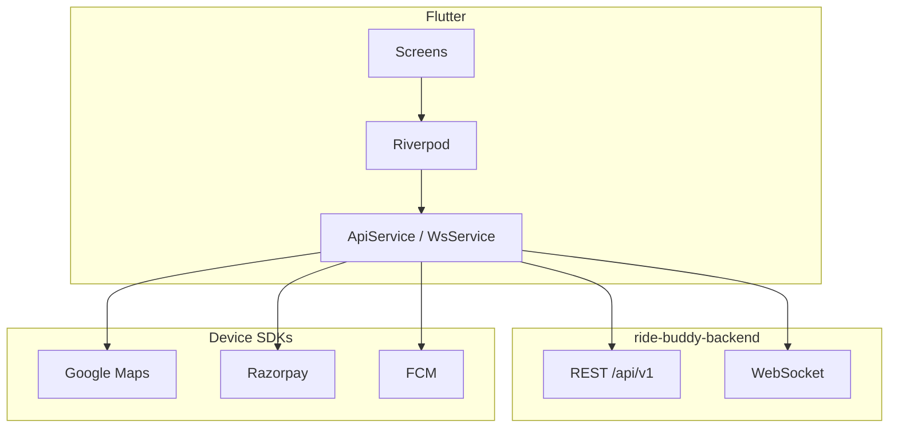

# Ride Buddy — Mobile Plan

**Project:** `ride-buddy-mobile`  
**Stack:** Flutter  
**Package ID:** `com.alnlabs.ridebuddy`  
**Status:** Phase 0–4 base implemented (auth, profile, vehicles, rides, booking, OSM maps)

---

## Overview

Flutter app for **Ride Buddy** — employee carpool, job referrals, and meetups (India).

| Layer | Choice |
|-------|--------|
| Framework | Flutter (latest stable) |
| State | Riverpod |
| Routing | go_router |
| HTTP | dio |
| Realtime | web_socket_channel / STOMP client |
| Maps | flutter_map + OpenStreetMap tiles (Leaflet-style) |
| Places | Nominatim geocoding (no Google Maps key) |
| Payments | Cash only in base; razorpay later |
| Push | firebase_messaging (later phase) |
| Config | flutter_dotenv |
| Errors | sentry_flutter (Phase 10) |

**Backend:** [`../ride-buddy-backend`](../ride-buddy-backend) — Spring Boot REST + WebSocket

---

## Product vision

Three major features under one brand:

| Feature | Credits? | Payments |
|---------|----------|----------|
| **Ride** (main) | No | Razorpay / cash |
| **Job Referrals** | Yes | — |
| **Meetups** | Yes | — |

**Audience:** Employees — office carpool, job referrals, shared interests.

**Bottom nav:** Home · Ride · Jobs · Meetups · Profile

---

## Branding (locked)

| Item | Spec |
|------|------|
| **Name** | Ride Buddy |
| **Logo** | Icon only — transparent PNG; blue car `#2563EB` + orange buddies/skyline `#F97316` |
| **Wordmark** | Flutter text: **Ride** (blue) + **Buddy** (orange) |
| **Tagline** | "Carpool · Jobs · Meetups" |

```dart
// lib/theme/app_theme.dart (planned)
static const brandBlue = Color(0xFF2563EB);
static const brandOrange = Color(0xFFF97316);
```

**Assets (Phase 0):**
- `assets/logos/app_icon.png` — master icon, transparent, 1024×1024
- `assets/logos/app_icon_foreground.png` — Android adaptive

**Splash layout:**
```text
[Icon]
Ride Buddy
Carpool · Jobs · Meetups
```

---

## Architecture



---

## Terminology (UI copy)

**Never use "driver".**

| Role | Label |
|------|-------|
| Posts / hosts a trip | Host |
| Books a seat | Co-rider |
| Owns their vehicle(s) | Owner (garage / personal, not trip role) |
| Offers + books | Toggle Offer / Need ride |

---

## Planned project structure

```
ride-buddy-mobile/
├── plan.md
├── pubspec.yaml
├── .env.example
├── assets/logos/
├── lib/
│   ├── main.dart
│   ├── app.dart
│   ├── config/env.dart
│   ├── theme/app_theme.dart
│   ├── models/
│   ├── services/       # api, auth, ride, websocket, maps, payments
│   ├── providers/
│   ├── router/
│   ├── screens/
│   │   ├── auth/
│   │   ├── home/
│   │   ├── ride/
│   │   ├── jobs/
│   │   ├── meetups/
│   │   ├── wallet/
│   │   ├── profile/
│   │   │   ├── vehicles_screen.dart
│   │   │   └── places_screen.dart
│   │   ├── settings/   # feedback, about, legal
│   │   └── trip/
│   └── widgets/common/
└── docs/
```

---

## Key mobile flows

- **Registration:** phone → OTP → name → Home (~60s)
- **Profile strength:** Basic, Places (home+office), Experience, Interests (≥5), Engagement, Referrals, Vehicle(s), Safety
- **Multi-vehicle:** Profile → My Vehicles; pick vehicle when posting ride
- **Comfort rides:** toggle when vehicle `seats >= 4`
- **Search:** Home → Office default; best-match + commute badges
- **WhatsApp share:** formatted ride/job/meetup links
- **SOS:** active trip safety actions
- **Settings:** feedback, feature request, report bug, About ALNLabs, legal, delete account

---

## UX principles

- ≤3 taps for core flows
- Skeleton loaders, empty states, offline banner
- Cached lists; debounced search (400ms)
- Maps lazy-loaded on detail screens only

---

## Phased delivery

| Phase | Mobile scope |
|-------|----------------|
| **0** | Flutter scaffold, deps, theme (brand colors), logo assets, `.env.example`, common widgets |
| **1** | Auth screens, onboarding, profile/places/interests, strength UI, offer/need toggle |
| **2** | My Vehicles, post ride (vehicle picker), comfort toggle, owner dashboard |
| **3** | Search, booking, My Trips, WhatsApp share |
| **4** | flutter_map + OSM tiles, Nominatim autocomplete, route/detail map, pickup/drop picker |
| **5** | In-app chat UI |
| **6** | Active trip map, live tracking, SOS UI |
| **7** | Post-trip feedback (word chips), My Feedback inbox, trust color display |
| **8** | Razorpay checkout, cash option |
| **9** | FCM + notification settings |
| **10** | NFR: Sentry, support screens, About, legal, Play Store prep |
| **11** | Meetups + Connect Engine UI |
| **12** | Credits wallet UI |
| **13** | Job referrals UI + cash redemption |

---

## Dependencies (planned)

| Package | Purpose |
|---------|---------|
| `flutter_riverpod` | State |
| `go_router` | Navigation |
| `dio` | REST client |
| `web_socket_channel` | Realtime |
| `google_maps_flutter` | Maps |
| `geolocator` | GPS |
| `razorpay_flutter` | Payments |
| `firebase_messaging` | Push |
| `flutter_dotenv` | Secrets |
| `sentry_flutter` | Crash reporting |
| `connectivity_plus` | Offline detection |
| `cached_network_image` | Avatars |
| `share_plus` | Share fallback |
| `package_info_plus` | Version / About |

---

## External setup

1. Backend API base URL (dev: `http://localhost:8080/api/v1`)
2. Google Maps API keys (Android/iOS)
3. Razorpay test keys
4. Firebase project (FCM)
5. Sentry DSN (Phase 10)

---

## Reference

- UI patterns: [`padha-vinodam-app`](../../apps/padha-vinodam-app) (Riverpod, go_router conventions)
- Full product spec: shared decisions in monorepo root planning docs

---

## Not in scope yet

- Implementation / `flutter create`
- Store listing publish
- Production signing keys
